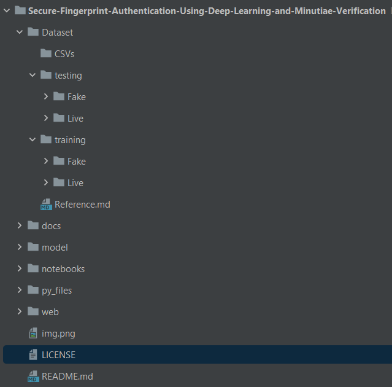

# Secure-Fingerprint-Authentication-Using-Deep-Learning-and-Minutiae-Verification
Deep Convolutional Neural Network as a pre-verification filter to filter out bad or malicious fingerprints

---

Nowadays, there has been an increase in security concerns regarding fingerprint biometrics. This problem arises due to technological advancements in bypassing and hacking methodologies. This has sparked the need for a more secure platform for identification. In this paper, we have used a deep Convolutional Neural Network as a pre-verification filter to filter out bad or malicious fingerprints. As deep learning allows the system to be more accurate at detecting and reducing false identification by training itself again and again with test samples, the proposed method improves the security and accuracy by multiple folds. The implementation of a novel secure fingerprint verification platform that takes the optical image of a fingerprint as input is explained in this paper. The given input is pre-verified using Google’s pre-trained inception model for deep learning applications, and then passed through a minutia-based algorithm for user authentication. Then, the results are compared with existing models.

 
## Project flow

----

## Project Boilerplate

----
